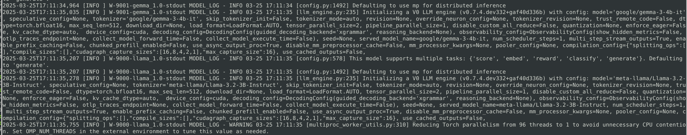

# Getting Started 
## Summary
Torchserve is an AI framework to load and serve models. Torchserve has the option to use vLLM as the underlying runtime. vLLM is an efficient LLM (Large Language Model) runtime for inference and serving. In this guide we will be going over how to archive, load, and serve the AI model of our choice with TorchServe.

In this tutorial we will go over the basics of leveraging torchserve and vLLM to deploy and serve models on MI300X. 
## System Configuration
```
Ubuntu 22.04 
CPU: 
  2 AMD EPYC 9454 48-Core Processor 
  2 Threads per core 
GPU: 
  8 MI300X
  192GB per gpu 
Memory: 
  3TB 
Storage: 
  11TB NVME
```
## Software
| package | version | 
| -- | -- |
| rocm|6.3.4.60304-76~22.04|
|vllm|0.7.4.dev332+gaf40d336b.rocm634|
|flash_attn|2.7.4.post1|
|transformers|4.50.0|
|triton|3.3.0+git03769c06|
|torch|2.7.0a0+git28b68b4|
|torchaudio|2.6.0a0+c670ad8|
|torchvision|0.22.0a0+124dfa4|
|torchserve|0.12.0b20250325|
|torch-model-archiver|0.12.0b20250325|
|torch-workflow-archiver|0.2.15b20250325|

## Useful terms to know
Tokens 
  - an array/matrix of numerical representations which can represent text, images, or audio; Usually in float16 or float32.

Inference 
  - the act of using or benchmarking a model that has already gone through the initial training process. We can use these models as is or fine-tune them to better fit our use case.  

Quantization
  - a method to reduce the size of an AI model, usually down to fp8. There are various things that can be quantized, the weights, the activations, and the kv (key-value) cache. 

## Building the TorchServe Image
- Our base image will be an image built from the rocm/vllm fork
- We will also be patching the vllm_handler.py from torchserve to be compatible with the latest vLLM 0.7+
```dockerfile
ARG BASE_IMAGE="amdaccelcloud/ce:ubuntu22.04_rocm6.3.4_py3.12_torch2.7.0_rocm-vllm_03-24-2025"

FROM $BASE_IMAGE AS base
SHELL ["/bin/bash", "-c"]
WORKDIR /app

RUN apt-get update -q -y && apt-get install -y -q openjdk-17-jdk && rm -rf /var/lib/apt/lists/* && \
    git clone -b vllm-patch --recursive https://github.com/ozziemoreno/serve.git && \
    cd serve && python3 setup.py bdist_wheel --dist-dir=/packages && \
    cd /app/serve/model-archiver && python3 setup.py bdist_wheel --dist-dir=/packages && \
    cd /app/serve/workflow-archiver && python3 setup.py bdist_wheel --dist-dir=/packages


FROM $BASE_IMAGE AS final
SHELL ["/bin/bash", "-c"]
WORKDIR /app

RUN --mount=type=bind,from=base,src=/packages,target=/packages \
    if ls /packages/*.whl; then \
        pip3 install --no-cache-dir /packages/* ; \
    fi

RUN apt-get update -q -y && apt-get install -y -q openjdk-17-jdk wget && rm -rf /var/lib/apt/lists/* 

CMD ["/bin/bash"]
```
Once we have the dockerfile we can build the image that we will use. 
```bash
docker build -f Dockerfile.torchserve -t torchserve_demo .
```
### Run TorchServe Image
After the image is built successfully we can run the container. For our example we will also be mounting a volume pointing to our local NVME, where we will store all of our models.
```bash
docker run -it --privileged \
--network host \
--ipc host \
-v /media/12TBNVME/models:/models \
torchserve_demo:latest
```

## Serving a model 
We can serve a model using all gpus with the following example. 
- Depending on if the model is gated, you may need to provide a huggingface token with `HF_TOKEN`
- We can also set the huggingface cache if needed with `HF_HOME`
```bash
export HF_TOKEN="<token>"
export HF_HOME=/models

# Create a model_store for torchserve
mkdir -p /models/model_store

# Run torchserve with vllm as the runtime engine
python3 -m ts.llm_launcher --model_id meta-llama/Llama-3.2-3B-Instruct \
--disable_token_auth \
--engine vllm \
--model_store /models/model_store \
--model_name vllm
```
Once the model has been loaded onto all gpus and the server has started we can submit a curl command to test that it is working as expected. 
- the url will use the `model_name` we passed when serving the model `/predictions/<model_name>/1.0/v1/chat/completions`
```bash
curl -X POST http://127.0.0.1:8080/predictions/vllm/1.0/v1/chat/completions \
-H "Content-Type: application/json" \
-d '{"model": "meta-llama/Llama-3.2-3B-Instruct", "messages":[{"role":"system", "content": "You are a helpful assistant."},{"role": "user","content": "How do I make a cake?"}]}'
```
```json
{
  "id": "chatcmpl-4986650f72244bda8ddd026f3689b607",
  "object": "chat.completion",
  "created": 1742338809,
  "model": "meta-llama/Llama-3.2-3B-Instruct",
  "choices": [
    {
      "index": 0,
      "message": {
        "role": "assistant",
        "reasoning_content": null,
        "content": "Making a cake is a straightforward process that requires some basic ingredients and tools. Here's a step-by-step guide to making a simple cake:\n\nIngredients:\n\n* 2 cups of all-purpose flour\n* 1 teaspoon of baking powder\n* 1 teaspoon of salt\n* 1 cup of granulated sugar\n* 1/2 cup of unsalted butter, softened\n* 2 large eggs\n* 2 teaspoons of vanilla extract\n* 1 cup of whole milk, at room temperature\n* Optional: flavorings, nuts, or fruit\n\nTools:\n\n* 9-inch round cake pan\n* Non-stick cooking spray or butter\n* Electric mixer (stand or handheld)\n* Whisk\n* Measuring cups and spoons\n* Rubber spatula\n\nInstructions:\n\n1. **Preheat the oven:** Preheat your oven to 350°F (175°C). Make sure to adjust the oven racks to the middle position.\n2. **Prepare the cake pan:** Spray the cake pan with non-stick cooking spray or grease it with butter. This will ensure the cake releases easily from the pan.\n3. **Mix the dry ingredients:** In a medium bowl, whisk together the flour, baking powder, and salt. Set aside.\n4. **Cream the butter and sugar:** In a large mixing bowl, use an electric mixer to cream the butter and sugar until light and fluffy, about 2-3 minutes.\n5. **Add the eggs:** Beat in the eggs one at a time, allowing each egg to fully incorporate before adding the next. Beat in the vanilla extract.\n6. **Alternate the wet and dry ingredients:** With the mixer on low speed, gradually add the dry ingredients to the wet ingredients in three parts, alternating with the milk, beginning and ending with the dry ingredients. Beat just until combined.\n7. **Scrape down the bowl:** Stop the mixer and scrape down the sides of the bowl with a rubber spatula to ensure all ingredients are well incorporated.\n8. **Add optional flavorings:** If using, add your preferred flavorings, nuts, or fruit and fold them into the batter.\n9. **Pour the batter:** Pour the cake batter into the prepared cake pan and smooth the top.\n10. **Bake the cake:** Bake the cake",
        "tool_calls": []
      },
      "logprobs": null,
      "finish_reason": "length",
      "stop_reason": null
    }
  ],
  "usage": {
    "prompt_tokens": 48,
    "total_tokens": 512,
    "completion_tokens": 464,
    "prompt_tokens_details": null
  },
  "prompt_logprobs": null
}
```
### Archiving Model
As a starting point this is great but it doesn't offer us a lot of control over the workflow. We can accomplish this by using the torch-model-archiver. Although we will first need a yaml file specifying the configuration.
```yaml
# TorchServe frontend parameters
minWorkers: 1            
maxWorkers: 1            # Set the number of worker to create a single model instance
startupTimeout: 1200     # (in seconds) Give the worker time to load the model weights
deviceType: "gpu" 
asyncCommunication: true # This ensures we can cummunicate asynchronously with the worker
# parallelType: "custom"   # This lets TS create a single backend prosses assigning 4 GPUs
parallelLevel: 4

# Handler parameters
handler:
    # model_path can be a model identifier for Hugging Face hub or a local path
    model_path: "meta-llama/Llama-3.2-3B-Instruct"
    vllm_engine_config:  # vLLM configuration which gets fed into AsyncVLLMEngine
        max_num_seqs: 16
        max_model_len: 512
        tensor_parallel_size: 4
        served_model_name:
            - "meta-llama/Llama-3.2-3B-Instruct"
            - "llama3"
```
After the yaml has been saved for example as `model_config.yaml` we can use it in torch-model-archiver. 
```bash
torch-model-archiver --model-name vllm \
--version 1.0 \
--handler vllm_handler \
--config-file /models/model_store/model_config.yaml \
--archive-format no-archive \
--export-path /models/model_store/
```
This will create a folder under the export-path as `/models/model-store/vllm` with a new `model_config.yaml` that we can make changes to if needed. 
Now we can start the model and server with the parameters that we want. 
- In our yaml we have specified vllm to use 4 gpus instead of all gpus now.
- `max_num_seqs` as 16 
- `max_model_len` as 512
```bash
torchserve --start \
--ncs \
--model-store /models/model_store \
--models vllm \
--disable-token-auth
```
We can once again query the endpoint after the model has been served. 
```bash
curl -X POST http://127.0.0.1:8080/predictions/vllm/1.0/v1/chat/completions \
-H "Content-Type: application/json" \
-d '{"model": "meta-llama/Llama-3.2-3B-Instruct", "messages":[{"role":"system", "content": "You are a helpful assistant."},{"role": "user","content": "How do I make a cake?"}]}'
```

## Multiple Models
So we've gone through how to serve a model, and how to archive and serve a model with custom parameters, but now we want to serve multiple models. Well TorchServe can accomplish that easily.

### Creating multiple archives
First we need to take into account the number of our resources and how many models we want. 

Let's create two archives named `llama` and `gemma`.
```bash
torch-model-archiver --model-name llama \
--version 1.0 \
--handler vllm_handler \
--config-file /models/model_store/model_config.yaml \
--archive-format no-archive \
--export-path /models/model_store/
```
```bash
torch-model-archiver --model-name gemma \
--version 1.0 \
--handler vllm_handler \
--config-file /models/model_store/model_config.yaml \
--archive-format no-archive \
--export-path /models/model_store/
```
After creating the archives let's edit the files to specify the number of gpus we want, for our example we'll be giving each model two gpus. 
- An example of what the files should look like after our modifications 
```yaml
# TorchServe frontend parameters
minWorkers: 1            
maxWorkers: 1            # Set the number of worker to create a single model instance
startupTimeout: 1200     # (in seconds) Give the worker time to load the model weights
deviceType: "gpu" 
asyncCommunication: true # This ensures we can cummunicate asynchronously with the worker
  #parallelType: "custom"   # This lets TS create a single backend prosses assigning 4 GPUs
parallelLevel: 2

# Handler parameters
handler:
    # model_path can be a model identifier for Hugging Face hub or a local path
    model_path: "meta-llama/Llama-3.2-3B-Instruct"
    vllm_engine_config:  # vLLM configuration which gets fed into AsyncVLLMEngine
        max_num_seqs: 16
        max_model_len: 512
        tensor_parallel_size: 2
        served_model_name:
            - "meta-llama/Llama-3.2-3B-Instruct"
            - "llama3"
```
```yaml
# TorchServe frontend parameters
minWorkers: 1            
maxWorkers: 1            # Set the number of worker to create a single model instance
startupTimeout: 1200     # (in seconds) Give the worker time to load the model weights
deviceType: "gpu" 
asyncCommunication: true # This ensures we can cummunicate asynchronously with the worker
  #parallelType: "custom"   # This lets TS create a single backend prosses assigning 4 GPUs
parallelLevel: 2

# Handler parameters
handler:
    # model_path can be a model identifier for Hugging Face hub or a local path
    model_path: "google/gemma-3-4b-it"
    vllm_engine_config:  # vLLM configuration which gets fed into AsyncVLLMEngine
        max_num_seqs: 16
        max_model_len: 512
        tensor_parallel_size: 2
        served_model_name:
            - "google/gemma-3-4b-it"
            - "gemma3"
```
### Starting the server with multiple models 
Now that we have our configurations set up we can run the torchserve server. Notice how we are specifying both models in a comma separated list.
```bash
torchserve --start \
--ncs \
--model-store /models/model_store \
--models llama,gemma \
--disable-token-auth
```
In the logs we can see that both servers have been started using vLLM as its runtime. 

### Testing our models
Finally we can query both models 
- llama
```bash
curl -X POST http://127.0.0.1:8080/predictions/llama/1.0/v1/chat/completions \
-H "Content-Type: application/json" \
-d '{"model": "meta-llama/Llama-3.2-3B-Instruct", "messages":[{"role":"system", "content": "You are a helpful assistant."},{"role": "user","content": "How do I make a cake?"}]}'  
```
```json
{
  "id": "chatcmpl-d029d6531f6c4f8a986873c61e2224b6",
  "object": "chat.completion",
  "created": 1742922825,
  "model": "meta-llama/Llama-3.2-3B-Instruct",
  "choices": [
    {
      "index": 0,
      "message": {
        "role": "assistant",
        "reasoning_content": null,
        "content": "Making a cake can be a fun and rewarding experience. Here's a basic recipe and step-by-step guide to help you get started:\n\n**Ingredients:**\n\nFor a classic vanilla cake:\n\n* 2 cups all-purpose flour\n* 1 teaspoon baking powder\n* 1 teaspoon salt\n* 1 cup granulated sugar\n* 1/2 cup unsalted butter, softened\n* 2 large eggs\n* 2 teaspoons vanilla extract\n* 1 cup whole milk, at room temperature\n\nFor the frosting (optional):\n\n* 1 cup unsalted butter, softened\n* 2 cups powdered sugar\n* 1 teaspoon vanilla extract\n\n**Equipment:**\n\n* 9-inch round cake pan\n* Non-stick cooking spray or parchment paper\n* Electric mixer (stand or handheld)\n* Whisk\n* Rubber spatula\n* Measuring cups and spoons\n\n**Instructions:**\n\n1. **Preheat your oven:** Preheat your oven to 350°F (180°C).\n2. **Prepare the cake pan:** Spray the cake pan with non-stick cooking spray or line it with parchment paper.\n3. **Mix the dry ingredients:** In a medium bowl, whisk together the flour, baking powder, and salt. Set aside.\n4. **Mix the wet ingredients:** In a large mixing bowl, use an electric mixer to cream together the butter and sugar until light and fluffy.\n5. **Add eggs and vanilla:** Beat in the eggs one at a time, followed by the vanilla extract.\n6. **Alternate wet and dry ingredients:** With the mixer on low speed, alternately add the flour mixture and milk, beginning and ending with the flour mixture. Beat just until combined.\n7. **Scrape down the bowl:** Use a rubber spatula to scrape down the sides and bottom of the bowl.\n8. **Beat the batter:** Beat the batter for an additional 2-3 minutes, until it's smooth and creamy.\n9. **Pour the batter:** Pour the batter into the prepared cake pan and smooth the top.\n10. **Bake the cake:** Bake the cake for 25-30 minutes, or until a toothpick inserted into the center comes out clean.\n11. **Cool the cake:** Remove the cake from the oven and let it",
        "tool_calls": []
      },
      "logprobs": null,
      "finish_reason": "length",
      "stop_reason": null
    }
  ],
  "usage": {
    "prompt_tokens": 48,
    "total_tokens": 512,
    "completion_tokens": 464,
    "prompt_tokens_details": null
  },
  "prompt_logprobs": null
}
```
- gemma
```bash
curl -X POST http://127.0.0.1:8080/predictions/gemma/1.0/v1/chat/completions \
-H "Content-Type: application/json" \
-d '{"model": "google/gemma-3-4b-it", "messages":[{"role":"system", "content": "You are a helpful assistant."},{"role": "user","content": "How do I make a cake?"}]}'
```
```json
{
  "id": "chatcmpl-e2962f88b6984ff5aba56e25b44f3a21",
  "object": "chat.completion",
  "created": 1742922805,
  "model": "google/gemma-3-4b-it",
  "choices": [
    {
      "index": 0,
      "message": {
        "role": "assistant",
        "reasoning_content": null,
        "content": "Okay, let's make a cake! It can seem daunting, but breaking it down into steps makes it totally achievable. Here's a guide to making a basic vanilla cake – it’s a great starting point, and you can easily adapt it with flavors and frostings.\n\n**I. The Basic Vanilla Cake Recipe**\n\nThis recipe makes a 9-inch round cake.\n\n* **Ingredients:**\n    * 1 1/2 cups (180g) All-Purpose Flour\n    * 1 1/2 teaspoons Baking Powder\n    * 1/2 teaspoon Salt\n    * 1/2 cup (113g) Unsalted Butter, softened\n    * 3/4 cup (150g) Granulated Sugar\n    * 2 large Eggs\n    * 3/4 cup (180ml) Milk\n    * 1 teaspoon Vanilla Extract\n\n* **Equipment:**\n    * 9-inch Round Cake Pan\n    * Parchment Paper (optional, but highly recommended for easy removal)\n    * Mixing Bowls (large and medium)\n    * Electric Mixer (handheld or stand mixer)\n    * Spatula\n    * Measuring Cups & Spoons\n\n\n**II. Let’s Bake! - Step-by-Step Instructions**\n\n1. **Preheat & Prep:** Preheat your oven to 350°F (175°C). Grease and flour your cake pan. For extra insurance against sticking, cut a circle of parchment paper to fit the bottom of the pan and place it in after greasing.\n\n2. **Dry Ingredients:** In a medium bowl, whisk together the flour, baking powder, and salt. This ensures everything is evenly distributed.\n\n3. **Cream Butter & Sugar:** In a large bowl, cream together the softened butter and sugar with an electric mixer until light and fluffy. This usually takes 3-5 minutes.  Scraping down the sides of the bowl occasionally helps.\n\n4. **Add Eggs:** Beat in the eggs one at a time, mixing well after each addition.\n\n5. **Vanilla:** Stir in the vanilla extract.\n\n6. **Alternate Wet & Dry:** Gradually add the dry ingredients to the wet ingredients, alternating with the milk. Start and end with the dry ingredients.  Mix until *just*",
        "tool_calls": []
      },
      "logprobs": null,
      "finish_reason": "length",
      "stop_reason": null
    }
  ],
  "usage": {
    "prompt_tokens": 23,
    "total_tokens": 512,
    "completion_tokens": 489,
    "prompt_tokens_details": null
  },
  "prompt_logprobs": null
}
```
## References
https://pytorch.org/blog/deploying-llms-torchserve-vllm/
